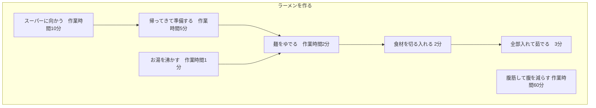

```mermaid

flowchart TB

subgraph "ラーメンを作る"
    super["スーパーに向かう　作業時間10分"]


    home["帰ってきて準備する　作業時間5分"];

    boil_hotwater["お湯を沸かす　作業時間1分"]

    boil_men["麺をゆでる　作業時間2分"]


    hukkin["腹筋して腹を減らす 作業時間60分"]

    cut["食材を切る入れる 2分"]

    yude["全部入れて茹でる　3分"]


end

super--->home

home--->boil_men

boil_hotwater--->boil_men;
boil_men--->cut;
cut--->yude;

 

```