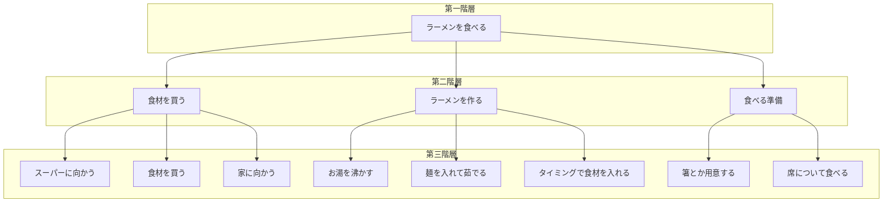

```mermaid
graph TD;
    id1["ラーメンを食べる"]
    id2["食材を買う"]
    id3["ラーメンを作る"]
    id4["食べる準備"]
    subgraph 第一階層
    id1
    end
    subgraph 第二階層
    id2
    id3
    id4
    end
    id1-->id2
    id1-->id3
    id1-->id4
    id5["スーパーに向かう"]
    id13["食材を買う"]
    id6["家に向かう"]
    subgraph 第三階層
    id2-->id5
    id2-->id6
    id2-->id13
    id7["お湯を沸かす"]
    id8["麺を入れて茹でる"]
    id9["タイミングで食材を入れる"]
    id3-->id7
    id3-->id8
    id3-->id9
    id10["箸とか用意する"]
    id11["席について食べる"]
    id4-->id10
    id4-->id11
    end
```