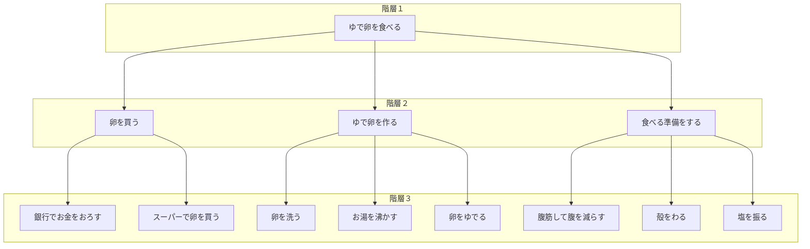

```mermaid

flowchart TB

subgraph "階層１"

    eat_egg["ゆで卵を食べる"]

end

subgraph "階層２"
    bay_egg["卵を買う"]
    cook_egg["ゆで卵を作る"]
    prepare_eat["食べる準備をする"]

end


subgraph "階層３"

    bank["銀行でお金をおろす"]
    super["スーパーで卵を買う"]

    washegg["卵を洗う"];
    yudemizu["お湯を沸かす"]
    yudetama["卵をゆでる"]

    hukkin["腹筋して腹を減らす"]
    crack["殻をわる"]
    salt["塩を振る"]

end


%% 階層２

eat_egg--->bay_egg;
eat_egg--->cook_egg;
eat_egg--->prepare_eat;


%% 階層３

bay_egg--->bank;
bay_egg--->super;

cook_egg--->washegg;
cook_egg--->yudemizu;
cook_egg--->yudetama;

prepare_eat--->hukkin;
prepare_eat--->crack;
prepare_eat--->salt;

 

```