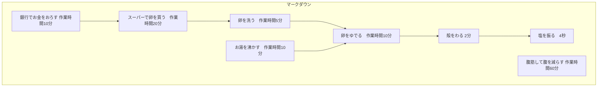

```mermaid

flowchart TB

subgraph "マークダウン"

    bank["銀行でお金をおろす 作業時間10分"]

    super["スーパーで卵を買う　作業時間20分"]


    wash_egg["卵を洗う　作業時間5分"];

    boil_hotwater["お湯を沸かす　作業時間10分"]

    boil_egg["卵をゆでる　作業時間10分"]


    hukkin["腹筋して腹を減らす 作業時間60分"]

    crack["殻をわる 2分"]

    salt["塩を振る　4秒"]

end

bank--->super;
super--->wash_egg

wash_egg--->boil_egg

boil_hotwater--->boil_egg;
boil_egg--->crack;
crack--->salt;

 

```